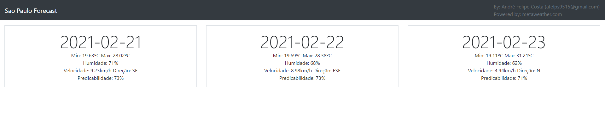

# React-Study

## About

The purpose is as the repository name says: Study react.

The project itself is a simple weather forecast of São Paulo using metaweather public API.

## Future

There are some plan for this project in the future. Such as:

- Use images to depict the general weather status
- Allow city selection or using a lat-long search
- Allow navigation to specific dates
- Add a proper service to communicate with metaweather API.

Adding more overall interactivity to the project given that it is pretty static as it is so I couldn't properly explore the React Component states behaviours.

## Notes

The only thing to keep in mind is that this application was never supposed to run in a producation environment. It won't work right out of the box, the main issue is CORs. There wasn't a proxy setup or any header manipulation so for this to work on a given machine it is necessary to install some plugin that intercepts CORs pre-flights requests so that it tricks the browser into allowing a request from localhost to metaweather.
